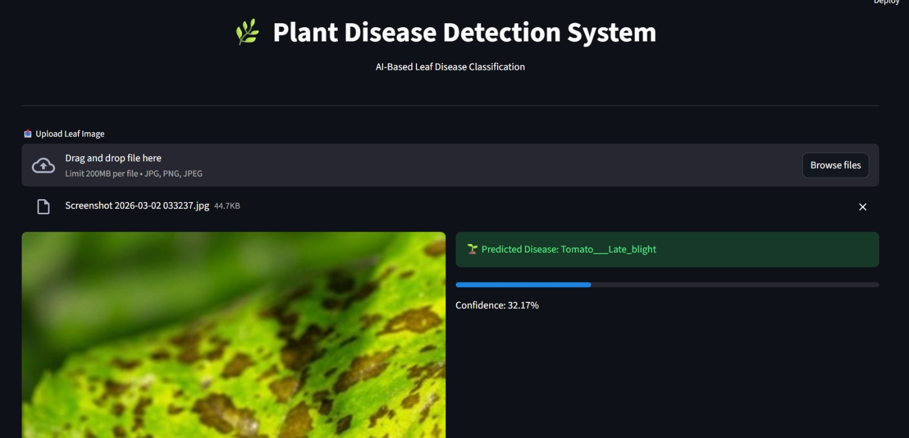
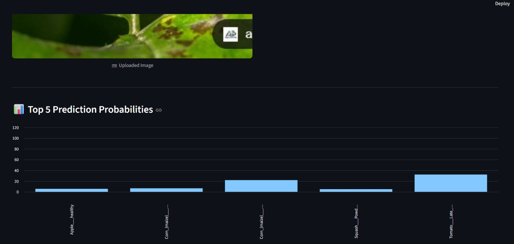
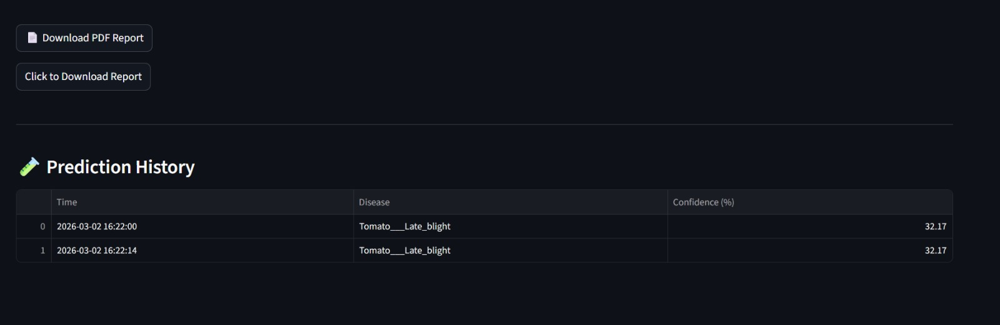

#  🌱 Plant Disease Detection

An AI-powered plant leaf disease classification project using **TensorFlow + MobileNetV2 (Transfer Learning)**.  
This repository includes:
- a **training pipeline** (`train.py`),
- a **single-image prediction script** (`predict.py`), and
- a **Streamlit web app** (`app.py`) for interactive inference, confidence visualization, prediction history, and PDF report download.

---

##  Dataset

This project is designed to work with the **PlantVillage** dataset hosted on Hugging Face:

- Dataset: **mohanty/PlantVillage**
- Link: https://huggingface.co/datasets/mohanty/PlantVillage

> Place the dataset in a local folder named `dataset/` so that each disease class is a subfolder (directory-per-class structure).

Expected structure:

```text
dataset/
  Apple___Apple_scab/
    image1.jpg
    image2.jpg
    ...
  Apple___Black_rot/
    ...
  Corn___Common_rust/
    ...
  ...
```

---

##  Features

- Transfer learning with **MobileNetV2**
- Automatic class-name export to `class_names.json`
- Streamlit UI for image upload and prediction
- Confidence score with top-5 class probability chart
- In-session prediction history table
- PDF report generation from the web app

---

##  Tech Stack

- Python 3.9+
- TensorFlow / Keras
- Streamlit
- NumPy
- Pillow
- Pandas
- ReportLab

---

##  Screenshots

###  Prediction Result


###  Prediction Graph


###  Training History



##  Installation

 lone the repository:

```bash
# HTTPS
git clone https://github.com/jwalasai7077/Plant-Disease-Detection.git

cd Plant-Disease-Detection
```
 Repository URL: https://github.com/jwalasai7077/Plant-Disease-Detection

---

##  Model Training

Run training with:

```bash
python train.py
```

What this does:
- Loads images from `dataset/`
- Uses an 80/20 train-validation split
- Builds a transfer learning classifier on top of MobileNetV2
- Trains for 40 epochs
- Saves:
  - `plant_disease_model.h5`
  - `class_names.json`

---

##  Run the Web App

Start the Streamlit app:

```bash
streamlit run app.py
```

Then open the local URL shown in terminal (typically `http://localhost:8501`).

### App workflow
1. Upload a leaf image (`.jpg`, `.jpeg`, `.png`)
2. View predicted disease and confidence score
3. Inspect top-5 probability chart
4. Track prediction history in the session
5. Download a PDF report

---


##  Acknowledgment

- PlantVillage dataset on Hugging Face: https://huggingface.co/datasets/mohanty/PlantVillage
- TensorFlow/Keras transfer learning ecosystem

